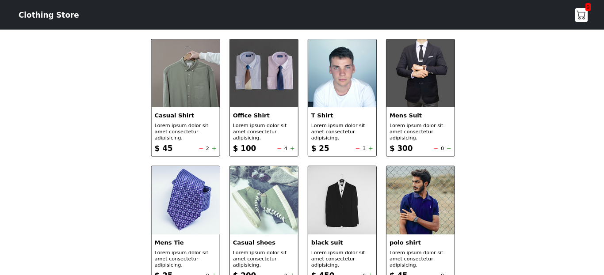
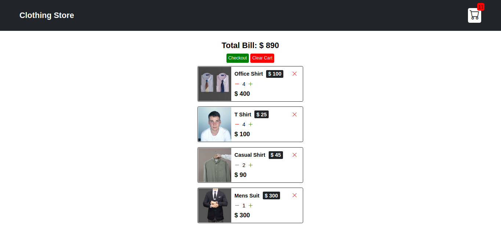
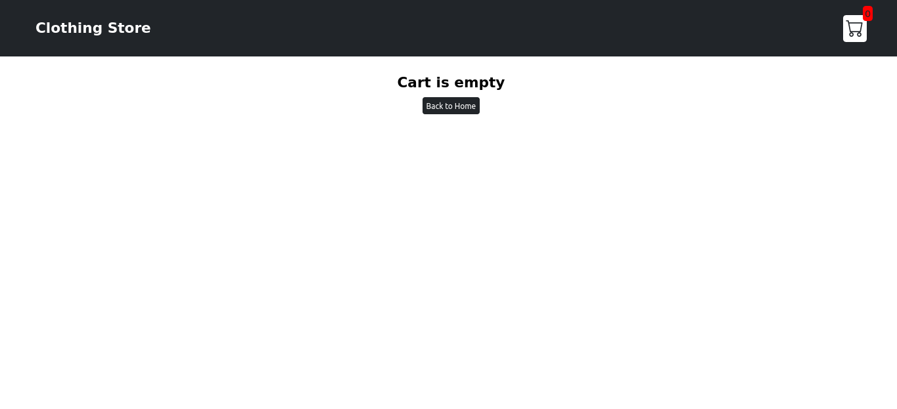

# Shopping Cart with vanilla JS

## Table of contents

- [Functionality](#Functionality)
- [Screenshot](#screenshot)
- [Links](#Links)
- [Process](#Process)
- [Acknowledgements](#Acknowledgements)

### Functionality 

**Shop Page:**  
- No. of items is selected with +/- buttons.
- Total Items is updated on the cart icon in navbar.
- Responsive Layout.
- Data gets Stored in browser's Local Storage and doesn't vanish on refresh.

**Cart Page:**  
- Selected items is displayed with their quantity.
- Total Price of all the item is calculated.
- Implementation of clear cart and delete(x) button.
- Cart item is removed as soon as its quantity reaches zero.

### Screenshot 





### Links 

[Live Site URL](https://saurabh-gih.github.io/Shopping-Cart/)

### Process 

I have built this project with HTML, vanilla CSS, and JavaScript. This project is separated into two sections: **Shop Page** and **Cart Page**.

- **Shop Page**  
    Navbar contains three things Main Header, cart icon, and cart amount Total no. of items present in the cart. **Bootstrap icons** is used for the icons.

    The shop cards are built using javascript. Initially, one card is styled properly then it is changed and duplicated using javascript.

    The generateShop() function creates the item cards as follows.
    1. Data is fetched from data.js and each item is accessed using map function.
    2. The code for shop cards is injected using `shop.innerHTML` and template literals is used in place of hard-coded values of each card.

    A empty array is initialised named basket in order to store the selected items.

    The Increment() function increments the no. of items in the basket.
    1. Add onclick event on the '+' button and call the `increment(${id})` with id as the argument.
    2. Search the shop card of which the button was clicked using 'id' and find().
    3. If item is not found then push that item in basket with an object with id and no. of items equal 1.
    4. If item is already there then simply just increase the count of no. of items.

    The Decrement() function decrements the no. of items in the basket.
    1. Call Decrement(${id}) function onclick event of '-' button.
    2. If no item is present or the no. of item <= 0, do nothing, otherwise decrement no. of items in basket.


    The Update() writes the innerHTML in element between the +/- buttons.
    1. Call update() fxn whenever increment()/decrement() fxn is triggered.
    2. Search for the card using find() and ${id}.
    3. If the item is found and not undefined then change the innerHTML of the element with `id=${id}`.

    ```js
    <div id=${id} class="quantity">
        ${search.noOfItems===undefined?0:search.noOfItems}
     </div>
    ```
    
    The Calculation() function calculates the sum of all the no. of items selected.
    1. Calculate cart amount using reduce function on array of no. of items generated by mapping on basket.
    2. It must be every time the item quantity is updated.

    Implementation of local storage in browser.
    1. Browser must store the data every time the increment()/decrement() is triggered.
    2. Basket is initialised with the stored data, otherwise with left empty.
    3. Then the content of cards is updated according to the data present in the basket.
    4. Item is seached in basket using find() and data is set according to it.

    ```js
    localStorage.setItem("data", JSON.stringify(basket))
    ```
    ```js
    let basket = JSON.parse(localStorage.getItem("data")) || [];
    ```

- **CART PAGE**  

    The card page contains only the selected cards, the total amount of individual card-item, and Sum total of all the card amounts.

    GenerateCartItems() creates the item cards.
    1. To put only those cards which have been selected we have to map over basket array.
    2. After taking the item id from the basket fetch the details of the item from data.js.
    3. If no card is selected leave the `shoppingCart.innerHTML` empty.
    4. Show the Empty Cart page with home button.

    Increment(), Decrement(), Calculation(), and update() functions are copied as it is from the `main.js` file.
    1. When the items are decremented to zero they are filtered from the basket array.
    2. GenerateCartItems() is called every time there is increment or decrement of removal of data.

    Total Amount() calculates the total amount for the all the cart items.
    1. If any item is present in the basket then it is mapped using map function and total amount of one item is calculated by `no. of items * item's price`.
    2. Item's price can be obtained through mapping over shopItemsData array in data.js.
    3. Sum is produced through reduce() and innerHTML of element label is created.

    Clear Cart() clear the element present in basket.
    1. Assign basket to empty array.
    2. Call GenerateCartItems(), Calcution(), and update the local storage.

    removeItem() removes the item as soon as its quantity reaches zero.
    1. filter the basket array and remove the zero quantity items.
    2. Update local storage, total amount, calculation, and regenerate cart items.

### Acknowledgements 

I would like to thank my tutor Joy Shaheb in this project who guided me throught the process. I would also like to thank [FreeCodeCamp](https://www.freecodecamp.org/) for bringing up the best education content for free. You can also checkout Joy Shaheb's [Youtube Channel](https://www.youtube.com/c/JoyShaheb) for more awesome content by him.


